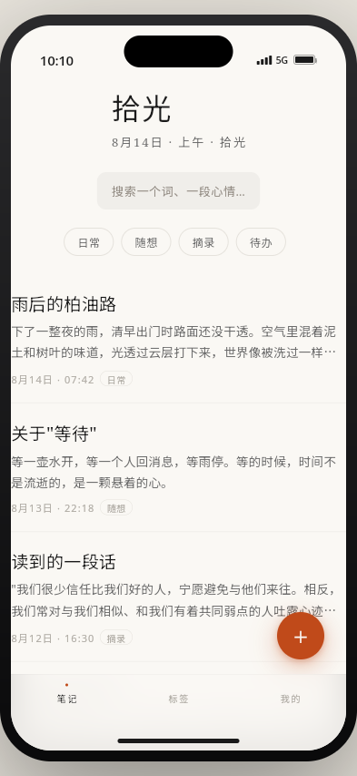
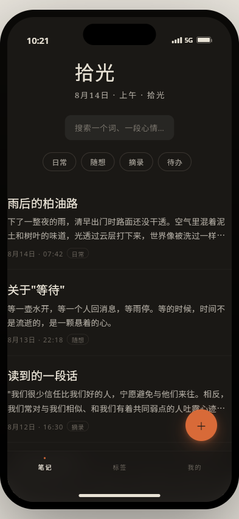
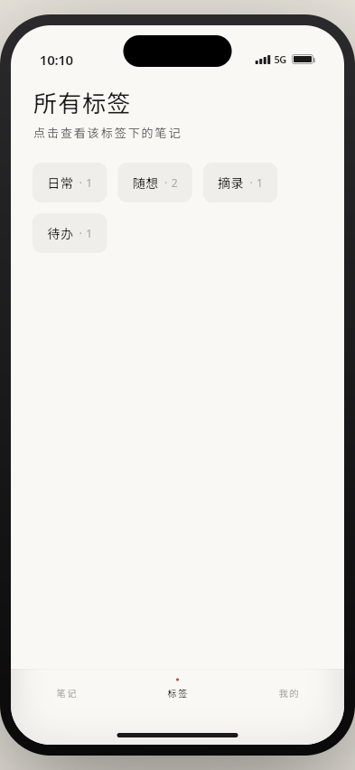
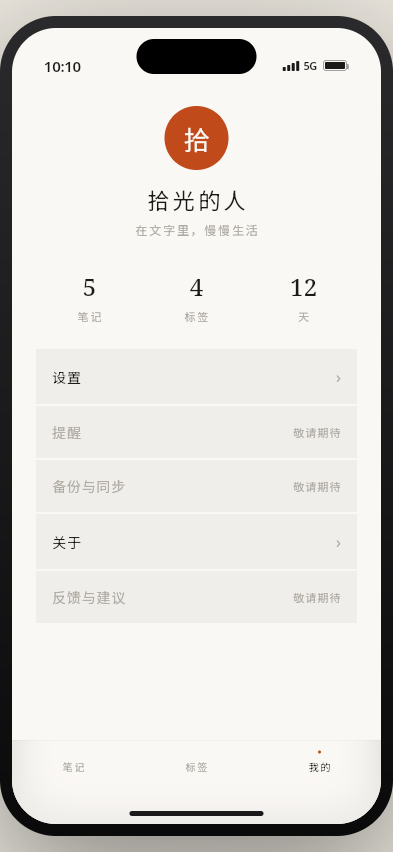
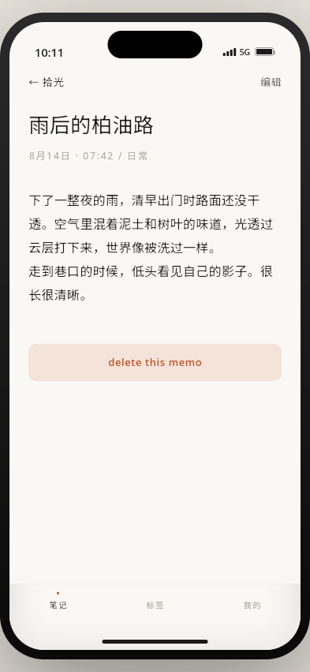
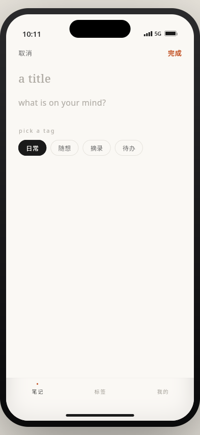
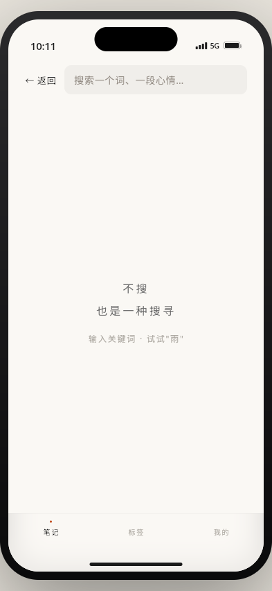
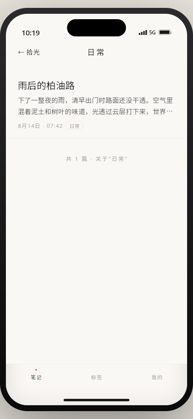
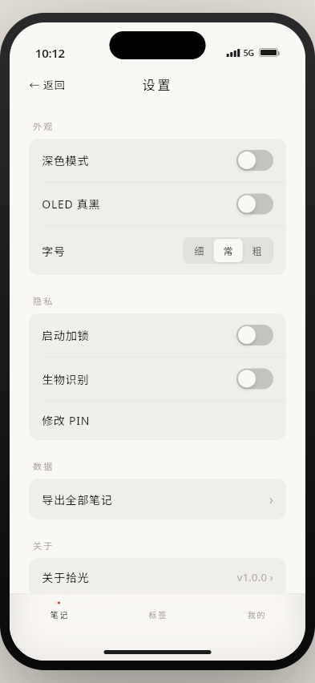
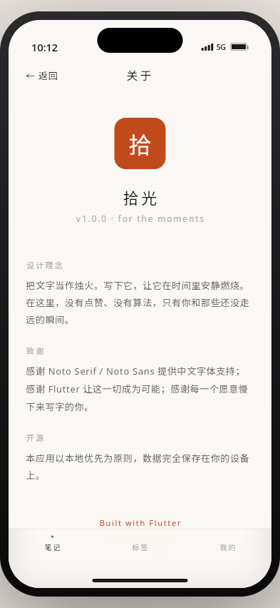

# 拾光 · 烛烬笔记

一款仿 iOS 视觉的纯本地离线备忘录 App，Flutter 跨平台实现。

## 截图预览

### 主界面（浅色）


### 主题切换


### 各核心页面

| 标签 | 我的 | 详情 | 编辑 |
| --- | --- | --- | --- |
|  |  |  |  |

| 搜索 | 标签筛选 | 设置 | 关于 |
| --- | --- | --- | --- |
|  |  |  |  |

## 功能

### 核心（对应还原 memo-app-v2 原型）
- 列表 / 详情 / 编辑 / 搜索 / 标签 / 我的 / 设置 / 关于 — 全部 UI 100% 自绘
- 仿 iOS 设备框 + 状态栏 + Dynamic Island + Home Indicator + 毛圆渐色底部 Tab Bar
- 主题切换：浅色 / 深色 / OLED 真黑 + 280ms 动画过渡
- 字号三档：小 14 / 中 16 / 大 18

### 增强
- SQLite 本地持久化（`sqflite`），启动种子5 条示例笔记
- PIN 加锁（4 位数字，`flutter_secure_storage` 加密存储）
- 生物识别解锁（`local_auth`）
- JSON 导出 / 导入（`share_plus`）
- Noto Serif SC + Noto Sans SC 字体（`google_fonts`）
- 纯本地原则：不集成任何分析 / 推送 SDK

### 跨平台
- Android 7.0+（minSdk 21）— 见 [Releases](https://github.com/lalaluya/memo_app/releases) 下载 APK / AAB
- iOS 13.0+（macOS 上 `flutter build ios --release` 生成 IPA）
- Web — `flutter build web` 后可直接在任意静态服务器运行

## 系统要求

- Flutter 3.24.5+
- Android SDK 34+ / Build Tools 34+
- JDK 17

## 构建

```bash
flutter pub get
flutter build apk --release --split-per-abi
flutter build appbundle --release
flutter build web --release
```

发布签名配置见 `android/key.properties` + `android/keystore/memo_app.jks`（不随仓库提交）。

## 项目结构

```
lib/
├── main.dart                     # Web sqlite 初始化
├── app.dart                      # MaterialApp + Theme
├── theme/                        # 浅 / 深 / OLED ColorScheme
├── data/
│   ├── models/                   # Memo, AppSettings
│   ├── db/                       # sqflite 建表 + 种子
│   └── repositories/             # CRUD
├── providers/                    # riverpod state
├── screens/                      # 列表 / 详情 / 编辑 / 搜索 / 标签 / 我的 / 设置 / 关于 / 锁
├── widgets/                      # 自绘：Toast / 对话框 / 状态栏 / Dynamic Island / Tab Bar
└── router/                       # 自定义 slideRoute 路由
```

## 致谢

- Noto Serif / Sans SC — Google Fonts
- Flutter — 让这一切成为可能
